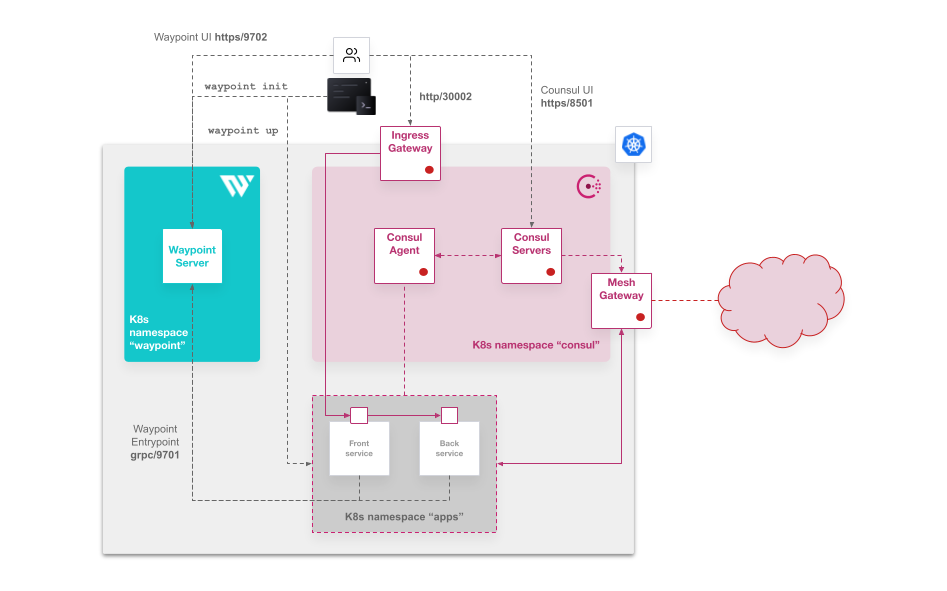
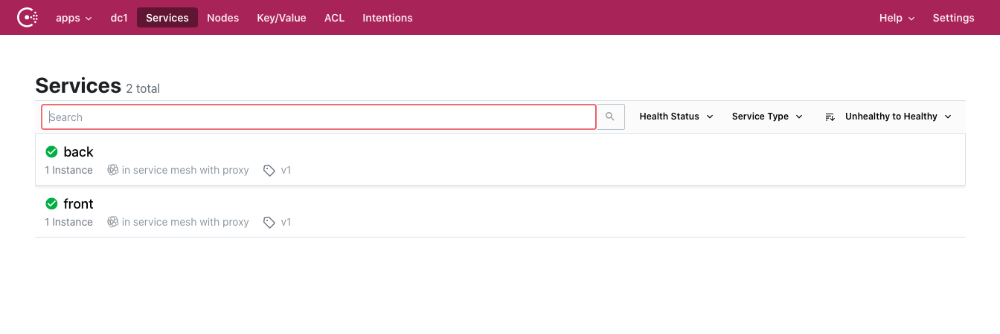
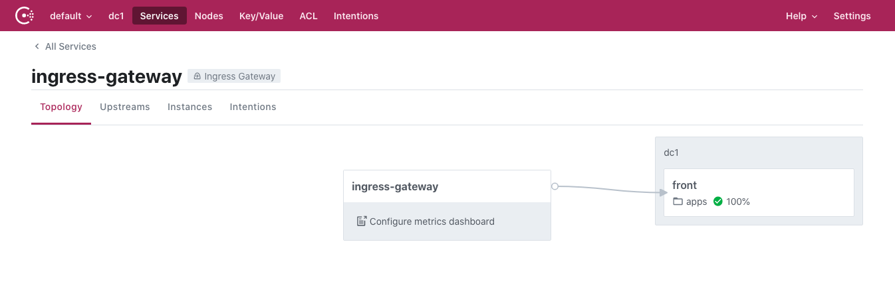
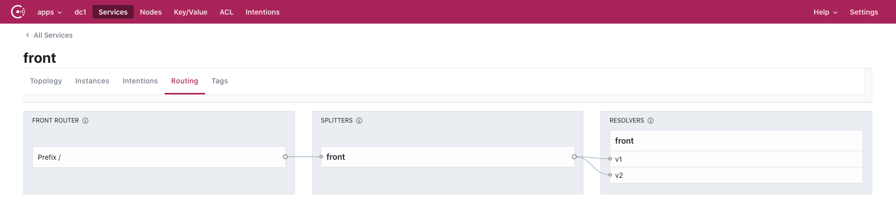
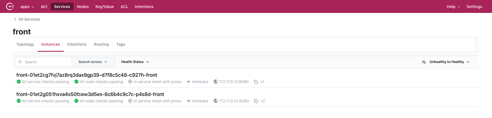

# Using Waypoint to deploy applications in a zero-trust network with Consul

This repo has an example of Waypoint configuration to deploy a *dumb*  micro-service example of application that uses [Consul connect annotations]() to be able to implement a *zero-trust* network configuration with [HashiCorp Consul](https://www.consul.io/).  

## Requirements

* A Kubernetes cluster, either your local cluster (you can use [Minikube](https://minikube.sigs.k8s.io/docs/start/), [k3s](https://k3s.io/), [kind](https://kind.sigs.k8s.io/docs/user/quick-start/#installation) or any other of your preference) or a non local cluster (GKE, EKS, AKS...)
* [`kubectl`](https://kubernetes.io/docs/tasks/tools/install-kubectl/) installed 
* [Helm](https://helm.sh/docs/intro/install/) binary installed
* HashiCorp Waypoint 0.2.0+ binary installed ([download it here](https://www.waypointproject.io/downloads))
* HashiCorp Consul 1.8.6+ binary installed ([download it here](https://www.consul.io/downloads)).
* A Linux or MacOS terminal (you should be able to use Windows with the corresponding tools, but I didn't test it)

## Context

When developing services (or microservices) as part of a bigger application in a dynamic environment it is essential to rely on a [zero-trust network](https://www.hashicorp.com/resources/how-zero-trust-networking) that let us configure routing and visibility between services, based on identity. In this example, we are deploying a *Hello World* Python application with a `frontend` microservice that connects to a `backend` microservice when a specific URL path of the front end is used.

The goal of this example is showing how a developer is able to define the service upstream communication at deployment level without any specific knowledge of the platform (Kubernetes in this case). Also, how operators can control service traffic security by allowing only the right service communication by a simple connection definition with Consul. And last, but not least, how managing traffic for different versions of the services deployed in a [Progressive Delivery](https://redmonk.com/jgovernor/2019/08/07/hashiconf-eu-2019-the-service-mesh-push/) scenario is defined by developers and/or operators.

The simple workflow would be something similar to:
* Define services build and deploy configuration with HashiCorp Waypoint
  * Configure the build stage by defining a `docker` builder that builds your container based on your `Dockerfile`
  * Define the deployment stage by specifying the use of the `kubernetes` deployer. At this stage the developer just configures the port number that the service uses, the service name, and a couple of annotations specifying that there is a service upstream to be recognized by Consul. But no Kubernetes manifest needs to be written. It is passed as a configuration description of your deployment tool, Waypoint.
* Build and deploy your services with Waypoint execution. Execute it or automate it with your desired CI/CD pipeline engine
* Connect and secure your services with HashiCorp Consul
  * Operators can select the right service connection for the `Ingress` traffic
  * Configure only the allowed connections between service identities, even with the namespace isolation if needed
  * Define traffic splitting and resolution for your services versions


By using this repository you would work on an architecture like this one:




> NOTE: The Mesh Gateway is not part of the example, but it is configured in the Consul deployment values file in case you want to do a cluster federation for your service mesh. 

## Install Consul and Waypoint Server

### Install Consul

> NOTE: We are using Consul Enterprise to integrate [namespacing](https://www.consul.io/docs/enterprise/namespaces) of Consul with Kubernetes namespaces. Bear in mind that you can use the time limit of the trial license or [using your own Enterprise license](https://www.consul.io/commands/license).

We are installing Consul in the Kubernetes cluster with the `yaml` values file provided `consul.yaml`:

* Create a namespace where installing Consul:

  ```
  kubectl create ns consul
  ```

* Add the HashiCorp Helm repository:

  ```bash
  helm repo add hashicorp https://helm.releases.hashicorp.com
  ```

* Update the repos:

  ```bash
  helm repo update
  ```

* Install Consul with the Helm Chart:

  ```bash
  helm install consul -f consul/consul.yaml hashicorp/consul -n consul --version 0.27
  ```

> NOTE: The consul values file `./consul/consul.yaml` is configuring the UI and `Internet Gateway` (ingress) as a `NodePort` service. If you want to expose the services to the outside you may want to change it to `LoadBalancer` type. Please, check the [Consul Helm Chart](https://www.consul.io/docs/k8s/helm) docs to see the options available.
> You can use [this other `values` file](./consul/consul_gke.yaml) to deploy on other non-local Kubernetes cluster to use `LoadBalancer` type for the `ingress-gateway`, `mesh-gateway` (in the case you want to federate) and `consul-ui` services:
>   ```bash
>   helm install consul -f consul/consul_gke.yaml hashicorp/consul -n consul --version 0.27
>   ```


If you are using Minikube accessing to your Consul UI or API woud be in `https://$(minikube ip):30085` (the port is the one used in the `consul.yaml` configuration). If you want to check urls:

```bash
minikube service list (-p <profile>)
```

Last thing if you want to use Consul CLI for your server (replace the `$(minikube ip)` for the host IP of your cluster node if using `NodePort`):
```bash
export CONSUL_HTTP_ADDR="https://$(minikube ip):30085"
export CONSUL_TLS_SERVER_NAME="consul-server"
kubectl get secret -n consul consul-ca-cert -o jsonpath='{.data.tls\.crt}' | base64 -D > $HOME/.consul-ca-cert.crt
export CONSUL_CACERT="$HOME/.consul-ca-cert.crt"
```

> NOTE: If you have deployed Consul in a non-local Kubernetes cluster, there is a script in [`./consul/consul_env.sh`](./consul/consul_env.sh) that may help to configure previous variables.

You should be able to see the Consul agents and servers:
```
$ consul members
Node             Address          Status  Type    Build      Protocol  DC   Segment
consul-server-0  172.17.0.5:8301  alive   server  1.9.1+ent  2         dc1  <all>
consul-k8s       172.17.0.3:8301  alive   client  1.9.1+ent  2         dc1  <default>
```

### Install Waypoint Server

Let's install Waypoint Server using the same K8s cluster as using consul. 

* Create a namespace where installing Waypoint:

  ```
  kubectl create ns waypoint
  ```

* Install Waypoint with the Waypoint CLI:

  ```bash
  waypoint install -platform=kubernetes -nasmespace=waypoint -accept-tos
  ```

> NOTE: Waypoint service is using by default a `LoadBalancer` service, so the installation will wait till the `External-IP` is being assigned. If deploying in **Minikube** you will need to run `minikube tunnel` in a different terminal console. In case of other local Kubernetes installations you might need some tools like [MetalLB](https://metallb.universe.tf/faq/) or similar.

Once Waypoint is deployed and bootstraped you should be able to connect to Waypoint server. You can check with:

```
waypoint context verify
```

It should respond with a `... connected successfully.` message.

## Deploy the application with Waypoint

Waypoint is using `waypoint.hcl` configuration file to build and deploy your example application in the namespace `apps`. So first you need to be sure that the namespace exists or create it:

```bash
kubectl create ns apps
```

> NOTE: Waypoint configuration is uploading docker container images to a container registry. You need to change that in `waypoint.hcl` file and be sure that you have permissions to upload images from where you are executing Waypoint binaries.
> ```
> ...
> build {
>   use "docker" {}
>   registry {
>     use "docker" {
>       image = "<your_registry>/bk8s-front"
>       tag   = "latest"
>     }
>   }
> }
> ...
> ```

Then, it is about building and deploying with Waypoint:

* Initialize the project:
  
  ```bash
  waypoint init
  ```

* Deploy and release your `backend` application:
  ```bash
  waypoint up -app back
  ```

* Deploy and release your `frontend` application:
  ```bash
  waypoint up -app front
  ```

> NOTE: I have included a `Jenkinsfile` and `.gitlab-ci.yaml` in this repo to use Jenkins or GitLab to deploy using a `build > deploy > release` lifecycle with Waypoint (similar to `waypoint up`) with other preparation stages. If you want to use it you will need some **credentials** to configure in Jenkins or GitLab that connect to your HashiCorp Vault cluster (you will need also Vault to be deployed or you can use a development instance) where credentials would be stored, like the Waypoint token and the Docker registry credentials (I am using [GCR]() in the example). I am not going to get into details on this, but you can play around with them as a start.

## Implement Zero-trust with Consul

Now that you have deployed your two example services, you can implement a `zero-trust` network by controlling the traffic connections between services with Consul, just by the identities or names of the services.

First, check in Consul that your services have been automatically registered:



Let's deny all comunications between services in the namespace *apps*:

```bash
consul intention create -deny apps/"*" apps/"*"
```

To access to the application through the `ingress-gateway` you need to configure it in Consul with the included configuration file in [`./consul/ingress.hcl](consul/ingress.hcl):
```bash
consul config write consul/ingress.hcl
```

Consul UI should show in `Services > ingress-gateway > Topology` (in `default` namespace menu in the top left)  that the ingress redirects to `front` service:



Now, you can check that that the `front` application is accessible, but not the *full path* when trying to access the backend:
```
$ curl -X GET "http://$(minikube ip):30002"
Hello from frontend World
```

```
$ curl -X GET "http://$(minikube ip):30002/full"
<!DOCTYPE HTML PUBLIC "-//W3C//DTD HTML 3.2 Final//EN">
<title>500 Internal Server Error</title>
<h1>Internal Server Error</h1>
<p>The server encountered an internal error and was unable to complete your request. Either the server is overloaded or there is an error in the application.</p>
```
> NOTE: Change `$(minikube ip):30002` in the command with your `ingress-gateway` LoadBalancer ip that you can find from `kubectl get svc/consul-ingress-gateway -n consul` if you are not using minikube.

Now, let's allow only the communication between `front` service and `back` service:

```bash
consul intention create -allow apps/front apps/back
```

So now you should be able to access the full path of the application:
```
$ curl -X GET "http://$(minikube ip):30002/full"
Hello from frontend World and... Hello from backend World
```

## Progressive Delivery with Waypoint and Consul

Now, we are going to deploy a new version of our application with Waypoint connfiguration and configuring Consul to do a traffic split with our different versions.

### Consul configuration

Let's configure some service default configurations. We are using new [Consul CRDs](https://www.consul.io/docs/k8s/crds) to do the config:
```bash
kubectl apply -f consul/crds/service-defaults.yaml
```

Now, we configure the service resolution for two different service subsets (versions) depending on the specifig service tag:
```bash
kubectl apply -f consul/crds/service-resolver.yaml
```

And finally we split the traffic with 25% to `V1` and 75% to `V2`:
```bash
kubectl apply -f consul/crds/splitter.yaml
```

If everything is configured correctly you should see something like the following in Consul UI in `apps > Services > front > Routing`:



### Deploying new version with Waypoint

Let's modify our application with a new message in the `main.py` file of the `front` service ([located here](front/main.py)) in the line 38:

```python
...
 charset = response.info().get_content_charset()
    backend_data = response.read().decode(charset)

    return f'Hello my friends from frontend {front_target} and... {backend_data}'

if __name__ == '__main__':
  ...
```

So - when using the full url of the application - the message in the new version would be *Hello my friends from frontend World and... Hello from backend World*


To tell we are building a new version, let's change `front` version to `v2` in our versions state file [./versions.json](./versions.json) and save it. The reason of doing this is to have a file to be tracked for our versions:
```json
{
  "front": "v2",
  "back" : "v1"
}
```

Let's rebuild the application:
```bash
waypoint up -app front
```

After Waypoint finishes to deploy, you should see in Consul UI two different instances for your service `front` tagged with different versions, `v1` and `v2`:



So, if you access your application several times, you should realize that 25% of the times you are redirected to `v1` and 75% of the times you are redirected to `v2`:

```
$ curl -X GET "http://$(minikube ip):30002"/full
Hello my friends from frontend World and... Hello from backend World
$ curl -X GET "http://$(minikube ip):30002"/full
Hello my friends from frontend World and... Hello from backend World
$ curl -X GET "http://$(minikube ip):30002"/full
Hello my friends from frontend World and... Hello from backend World
$ curl -X GET "http://$(minikube ip):30002"/full
Hello from frontend World and... Hello from backend World
$ curl -X GET "http://$(minikube ip):30002"/full
Hello my friends from frontend World and... Hello from backend World
$ curl -X GET "http://$(minikube ip):30002"/full
Hello my friends from frontend World and... Hello from backend World
...
```

To change the `weight` of the different versions is just about updating the `ServiceSplitter` Custom Resource Definition:

```
$ kubectl get ServiceSplitter -n apps -o yaml
- apiVersion: consul.hashicorp.com/v1alpha1
  kind: ServiceSplitter
  metadata:
...
spec:
    splits:
    - namespace: apps
      service: front
      serviceSubset: v1
      weight: 25
    - namespace: apps
      service: front
      serviceSubset: v2
      weight: 75
...
```

## Cleaning your environment

You can delete the applications deployment with Waypoint:
```
waypoint destroy -app front
waypoint destroy -app back
```

If you want to uninstall everything you just can delete all namespaces created during this README:
```
kubectl delete -f consul/crds/
kubectl delete ns apps consul waypoint
```


